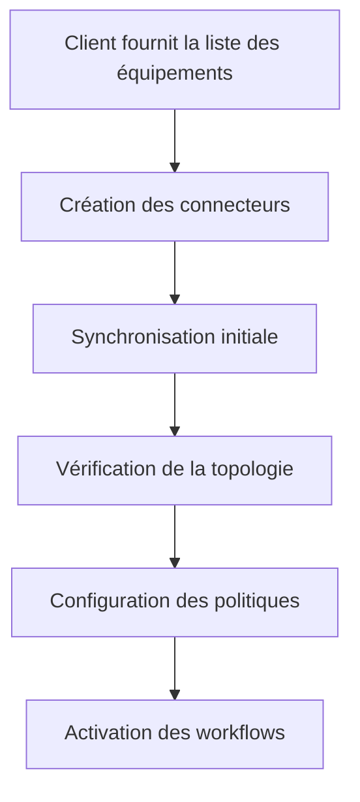
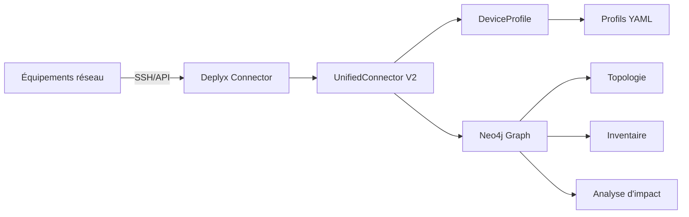

# Guide d'intégration client — Deplyx

## 1. Objectif

Connecter les équipements réseau d'un client à Deplyx pour :
- **Inventorier** automatiquement tous les équipements (routeurs, switches, firewalls)
- **Cartographier** la topologie réseau (voisinages CDP/LLDP, sous-réseaux)
- **Analyser l'impact** des changements avant de les appliquer
- **Gouverner** les changements (workflow d'approbation)

## 2. Prérequis réseau

### 2.1 Connectivité

Deplyx doit pouvoir joindre chaque équipement sur son port de management :

| Protocole | Port | Usage |
|---|---|---|
| SSH | 22 (ou autre) | Connexion aux équipements réseau (Cisco, Juniper, etc.) |
| HTTPS | 443 | API REST (FTD, Fortinet, Palo Alto) |
| SNMP | 161 | Découverte optionnelle (lecture seule) |

> ⚠️ **Recommandation** : Ouvrir uniquement les ports nécessaires depuis le serveur Deplyx vers les équipements. Ne pas exposer Deplyx sur Internet.

### 2.2 Comptes de lecture

Pour chaque équipement, le client doit fournir un compte **read-only** :

| Constructeur | User | Privilèges minimum |
|---|---|---|
| Cisco IOS | `monitor` | `privilege 1` + `show` commands |
| Cisco FTD | `api-user` | Accès API FDM / SSH |
| Fortinet | `viewer` | `get`, `show` |
| Palo Alto | `monitor` | Accès API REST lecture |
| Juniper | `operator` | `show` commands |
| Huawei | `monitor` | `display` commands |

> 💡 **Astuce** : Un même compte peut être réutilisé sur tous les équipements si la politique de sécurité le permet.

## 3. Workflow d'intégration



### 3.1 Étape 1 — Collecte des informations client

Le client fournit un tableau avec :

```csv
Nom,IP,Constructeur,OS,User,Password
FTD1,192.168.170.10,cisco,ftd,api-user,***
SW1,192.168.170.101,cisco,ios,monitor,***
FW-Core,10.0.0.1,fortinet,fortios,viewer,***
```

### 3.2 Étape 2 — Génération des profils YAML (optionnel)

Si le constructeur n'a pas encore de profil YAML dans Deplyx, on utilise le générateur :

```bash
# Manuel : documentation seulement
curl -X POST http://deplyx:8000/api/v1/connectors/generate-profile \
  -H "Authorization: Bearer <token>" \
  -d '{"vendor": "huawei", "os_name": "vrp"}'

# Auto : scan + credentials
curl -X POST http://deplyx:8000/api/v1/connectors/generate-profile \
  -H "Authorization: Bearer <token>" \
  -d '{"host": "10.0.0.1", "username": "monitor", "password": "***"}'
```

Le profil généré est écrit dans `profiles/<vendor>-<os>.yml` et utilisable immédiatement.

### 3.3 Étape 3 — Création des connecteurs

```bash
# Création d'un connecteur Cisco IOS
curl -X POST http://deplyx:8000/api/v1/connectors \
  -H "Authorization: Bearer <token>" \
  -d '{
    "name": "SW1-DC1",
    "connector_type": "cisco",
    "config": {
      "host": "192.168.170.101",
      "username": "monitor",
      "password": "***",
      "port": 22,
      "transport": "auto"
    },
    "sync_mode": "pull",
    "sync_interval_minutes": 60
  }'
```

**Types de connecteurs disponibles :**

| Type | Constructeurs couverts |
|---|---|
| `cisco` | IOS, IOS-XE |
| `cisco-ftd` | Cisco Firepower / FTD |
| `cisco-nxos` | NX-OS |
| `cisco-router` | Routeurs Cisco (ISR, ASR) |
| `fortinet` | FortiGate / FortiOS |
| `paloalto` | Palo Alto PAN-OS |
| `juniper` | Juniper JunOS |
| `aruba-switch` | Aruba switches |
| `aruba-ap` | Aruba access points |
| `vyos` | VyOS |
| `checkpoint` | Check Point Gaia |

### 3.4 Étape 4 — Synchronisation

```bash
# Sync immédiat
curl -X POST http://deplyx:8000/api/v1/connectors/{id}/sync \
  -H "Authorization: Bearer <token>"

# Sync de tous les connecteurs
curl -X POST http://deplyx:8000/api/v1/connectors/sync-all \
  -H "Authorization: Bearer <token>"
```

Le sync collecte automatiquement :

| Donnée | Source |
|---|---|
| Interfaces, IP, status | `show interfaces`, `show ip interface brief` |
| Routes | `show ip route` |
| VLANs | `show vlan brief` |
| ARP | `show arp` |
| Topologie CDP/LLDP | `show cdp neighbors detail`, `show lldp neighbors detail` |
| BGP peers | `show ip bgp summary` |
| Redondance (HSRP, VRRP) | `show standby brief`, `show vrrp brief` |
| ACLs | `show access-list`, `show ip interface` |
| Services | `show ip http server status` |

### 3.5 Étape 5 — Modes de synchronisation

| Mode | Déclencheur | Usage |
|---|---|---|
| `on-demand` | Manuel (API) | Tests, debug |
| `pull` | Automatique (intervalle) | Production — sync toutes les X minutes |
| `webhook` | Événement externe | Intégration avec des systèmes tiers |

## 4. Architecture technique



### 4.1 Flux d'un sync

```
1. Connexion SSH (Netmiko) ou API REST
2. Fingerprint → identification vendor/OS
3. Matching → profil YAML correspondant
4. Exécution des commandes du profil
5. Parsing (TextFSM ou LLM)
6. Normalisation en format standard
7. Push dans Neo4j (nœuds + relations)
8. Inférence de topologie (CDP/LLDP/sous-réseaux)
```

## 5. Dépannage

### 5.1 Le sync timeout

```bash
# Vérifier la connectivité depuis le serveur Deplyx
docker exec deplyx-backend python3 -c "
import socket
s = socket.socket(); s.settimeout(5)
s.connect(('192.168.170.101', 22))
print(s.recv(256).decode(errors='ignore')[:60])
s.close()
"

# Vérifier les logs
docker logs deplyx-backend --tail 50
```

### 5.2 "No transport could connect to device"

- Vérifier que le port SSH (22) est ouvert
- Vérifier les credentials (username/password)
- Vérifier que le `device_type` Netmiko est correct
- Essayer avec `transport: "ssh"` au lieu de `"auto"`

### 5.3 "Authentication failed"

- Le mot de passe a changé → mettre à jour le connecteur
- Le compte n'existe pas sur cet équipement
- Enable password requis → ajouter `enable_password` dans la config

### 5.4 Profil YAML non trouvé

Si le constructeur n'est pas encore supporté :

```bash
# 1. Générer le profil
curl -X POST .../connectors/generate-profile \
  -d '{"vendor": "hpe", "os_name": "procurve"}'

# 2. Le profil est créé dans profiles/hpe-procurve.yml
# 3. Créer le connecteur avec le type correspondant
```

## 6. Sécurité

- Les credentials sont stockés dans la table `connectors` (JSON, **non chiffrés actuellement** — prévoir du chiffrement en production)
- Les comptes doivent être **read-only** sur les équipements
- Le serveur Deplyx ne doit pas être accessible depuis Internet
- Utiliser un VLAN dédié pour le management
- Activer le circuit breaker (pause automatique après 3 échecs consécutifs)

## 7. Checklist de déploiement

- [ ] Connectivité réseau vérifiée (ports ouverts)
- [ ] Comptes read-only créés sur les équipements
- [ ] Profils YAML générés (si nouveau constructeur)
- [ ] Connecteurs créés dans Deplyx
- [ ] Sync initial réussi
- [ ] Topologie visible dans Neo4j
- [ ] Politiques de gouvernance configurées
- [ ] Workflows d'approbation testés
