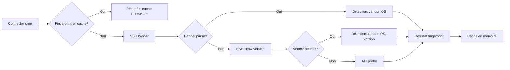

# Processus d'Import via les Connecteurs — Deplyx

## 1. Vue d'ensemble

Le système de **connecteurs** est le mécanisme central par lequel Deplyx collecte,
normalise et importe les données de l'infrastructure réseau dans un graphe Neo4j.
Il supporte **deux générations** de connecteurs :

| Génération | Description | Types |
|---|---|---|
| **V1 (legacy)** | Connecteurs spécifiques par constructeur | `cisco_ftd.py`, `paloalto.py`, `fortinet.py`, `juniper.py`, etc. |
| **V2 (unified)** | Connecteur unique auto-adaptatif basé sur *fingerprint* + *profiles* YAML | Détecte OS, choisit transport et commandes dynamiquement |

---

## 2. Architecture globale

```
┌──────────────┐      ┌──────────────────────┐      ┌─────────────────┐
│   Frontend   │─────▶│   API (FastAPI)      │─────▶│ Service Layer   │
│  (React/TS)  │      │  /api/v1/connectors  │      │ connector_svc   │
└──────────────┘      └──────────────────────┘      └────────┬────────┘
                                                             │
                                    ┌────────────────────────┼────────────────────────┐
                                    ▼                        ▼                        ▼
                           ┌──────────────────┐    ┌──────────────────┐    ┌──────────────────┐
                           │  Connector V1    │    │  Connector V2    │    │  Discovery API   │
                           │  (par type fixe) │    │  (UnifiedConn.)  │    │  (scan réseau)   │
                           └──────────────────┘    └──────────────────┘    └──────────────────┘
                                                             │
                                    ┌────────────────────────┼────────────────────────┐
                                    ▼                        ▼                        ▼
                           ┌──────────────────┐    ┌──────────────────┐    ┌──────────────────┐
                           │  Transport SSH   │    │  Transport API   │    │  TextFSM / LLM   │
                           │  (netmiko)       │    │  (requests)      │    │  Parsers         │
                           └──────────────────┘    └──────────────────┘    └──────────────────┘
                                                             │
                                    ┌────────────────────────┘
                                    ▼
                           ┌──────────────────┐
                           │  Neo4j Graph     │
                           │  (Device, Iface, │
                           │   Route, VLAN,   │
                           │   Topologie)     │
                           └──────────────────┘
```

---

## 3. Cycle de vie d'une sync

### 3.1 Déclencheurs

| Mode | Déclencheur | Endpoint |
|---|---|---|
| **On-demand** | Manuel (UI ou API) | `POST /connectors/{id}/sync` |
| **Pull** | Cron / planificateur | `POST /connectors/sync/pull` |
| **Webhook** | Appel externe | `POST /connectors/{id}/webhook` |
| **Sync-all** | Réinitialisation complète | `POST /connectors/sync-all` |

### 3.2 Flow complet (V2)

```
1. API reçoit requête → connector_service.execute_connector_operation()
2. Sémaphore (limite 20 syncs concurrentes)
3. Instanciation : _get_connector_instance()
   └─ Si type ∈ V2_TYPES → UnifiedConnector(config)
   └─ Sinon → classe legacy correspondante
4. UnifiedConnector.sync() :

   a. Circuit breaker : vérifie si l'hôte est en état d'erreur récent
   b. Fingerprint : detection de l'OS/type de l'équipement
      └─ Cache TTL 3600s
      └─ fingerprint_device() : essai SSH banner → SSH show version → API probe
      └─ Ou force le type si _connector_type est "cisco-ftd"
   c. Profile matching : DeviceProfile.find_match(fp, profiles)
      └─ Charge les profils YAML depuis connectors_v2/profiles/
      └─ Score : vendor=2pts, os=3pts
   d. Connexion : _connect()
      └─ Itère les transport_candidates du profil (ssh/api)
      └─ SSHTransport (netmiko) ou APITransport (requests)
   e. Collecte : _collect_all()
      └─ Itère les command_groups du profil
      └─ Execute commandes SSH/API
      └─ Parse output : TextFSM d'abord, LLM en fallback
   f. Push Neo4j : _push_to_neo4j()
      └─ Merge Device, Interface, Route, VLAN nodes
      └─ Crée relations : HAS_INTERFACE, HAS_ROUTE, HAS_VLAN
   g. Inférence topologie : _infer_topology()
      └─ Phase 1 : CONNECTED_TO (devices sur même subnet)
      └─ Phase 2 : PROTECTS (firewall → devices non-firewall)
5. Normalisation du résultat
6. Mise à jour du connector status en DB
7. Rerun de l'analyse des changements (change_service)
```

---

## 4. Composants détaillés

### 4.1 Fingerprint (détection automatique)



Fonction `fingerprint_device()` dans `device_profile.py` :
1. **Banner SSH** — Regex sur `_fingerprint_from_banner()`
2. **Commandes** — `show version`, `show system info`, etc. via `_fingerprint_from_ssh_cmd()`
3. **API probe** — Tentative d'appels REST (FDM, PAN-OS, etc.)

### 4.2 Profiles YAML

Chaque profil définit :

```yaml
# exemple: backend/app/connectors_v2/profiles/cisco-ios.yml
name: cisco-ios
vendor: cisco
os: ios

# Critères de matching
match_banner: ["Cisco", "IOS"]
match_cmd_output: ["cisco", "ios", "Cisco IOS Software"]

# Modes de connexion (priorité décroissante)
transports:
  - type: ssh
    priority: 10
    device_type: cisco_ios

# Commandes et leurs groupes
commands:
  show_version: "show version"
  show_interfaces: "show interfaces"
  show_ip_route: "show ip route"
  show_vlan: "show vlan brief"
  show_mac: "show mac address-table"
  show_cdp: "show cdp neighbors detail"
  show_bgp: "show ip bgp summary"

command_groups:
  system:     { refs: ["show_version"] }
  interfaces: { refs: ["show_interfaces", "show_ip_int_brief"] }
  routing:    { refs: ["show_ip_route", "show_bgp"] }
  switching:  { refs: ["show_vlan", "show_mac"] }
  topology:   { refs: ["show_cdp"] }
  all:        { refs: ["show_version", "show_interfaces", ...] }

parsers:
  show_version: textfsm
  show_interfaces: textfsm
```

Profils disponibles : `cisco-ios`, `cisco-ftd`, `cisco-nxos`, `cisco-router`, `fortinet-fortios`, `juniper-junos`, `paloalto-panos`, `linux-generic`, `generic-ssh`.

### 4.3 Transports

#### SSH (`transports/ssh.py`)
- Utilise **netmiko** (multi-vendor)
- Timeouts configurables (connexion=8s, commande=15s, banner=8s)
- Support clés RSA legacy `rsa-sha2-256/512`
- Circuit breaker anti-rate-limit

#### API (`transports/api.py`)
- Basé sur **requests**
- Autodécouverte des bases API (FDM versions latest/v7/v6)
- Login avec token ou API key
- SSL vérification désactivable

### 4.4 Parsers

| Parser | Usage |
|---|---|
| **TextFSM** (par défaut) | Templates Netmiko pour les commandes `show` |
| **LLM** (fallback) | Quand TextFSM échoue ou retourne `[{"raw":...}]` |

Le parser LLM est utilisé si :
- Le profil déclare `parser: llm` pour une commande
- TextFSM n'a pas réussi à parser
- Le LLM est configuré (provider OpenAI-compatible)

### 4.5 Push Neo4j

Pour chaque device synchronisé, `_push_to_neo4j()` crée :

```
(Device {id, hostname, vendor, type, ip, serial, model, os_version})
    │
    ├── [:HAS_INTERFACE] → (Interface {name, status, ip, mask})
    ├── [:HAS_ROUTE]     → (Route {network})
    └── [:HAS_VLAN]      → (VLAN {vlan_id, name})
```

### 4.6 Inférence de topologie

`_infer_topology()` est appelée **après chaque sync** :

1. **Phase 1 — CONNECTED_TO** :
   - Récupère toutes les interfaces avec IP
   - Calcule le subnet de chaque IP
   - Crée une relation `CONNECTED_TO` entre devices partageant le même subnet

2. **Phase 2 — PROTECTS** :
   - Identifie les devices de type `firewall` / `ftd`
   - Crée une relation `PROTECTS` vers tous les devices non-firewall

---

## 5. Connecteurs V1 (legacy)

Les connecteurs V1 sont des classes Python spécifiques par constructeur :

| Classe | Fichier | Constructeurs supportés |
|---|---|---|
| `CiscoFTDConnector` | `cisco_ftd.py` | Cisco Firepower/FTD (API FDM + SSH) |
| `PaloAltoConnector` | `paloalto.py` | Palo Alto PAN-OS |
| `FortinetConnector` | `fortinet.py` | FortiGate |
| `JuniperConnector` | `juniper.py` | Juniper JunOS |
| `CheckPointConnector` | `checkpoint.py` | Check Point |
| `ArubaSwitchConnector` | `aruba_switch.py` | Aruba switches |
| `ArubaAPConnector` | `aruba_ap.py` | Aruba AP |
| `CiscoNXOSConnector` | `cisco_nxos.py` | Cisco Nexus |
| `CiscoRouterConnector` | `cisco_router.py` | Cisco IOS routers |
| `CiscoWLCConnector` | `cisco_wlc.py` | Cisco WLC |
| `VyOSConnector` | `vyos.py` | VyOS |
| `StrongSwanVPNConnector` | `strongswan_vpn.py` | StrongSwan VPN |
| `SnortIDSConnector` | `snort_ids.py` | Snort IDS |
| `OpenLDAPConnector` | `openldap.py` | OpenLDAP |
| `NginxAppConnector` | `nginx_app.py` | Nginx |
| `PostgresAppConnector` | `postgres_app.py` | PostgreSQL |
| `RedisAppConnector` | `redis_app.py` | Redis |
| `ElasticsearchConnector` | `elasticsearch.py` | Elasticsearch |
| `GrafanaConnector` | `grafana.py` | Grafana |
| `PrometheusConnector` | `prometheus.py` | Prometheus |

Tous héritent de `BaseConnector` qui définit le contrat :

```python
class BaseConnector(ABC):
    async def run(self, request) -> dict       # Routeur d'opération
    async def sync(self) -> dict               # Sync complète
    async def validate_change(self, payload)   # Validation
    async def simulate_change(self, payload)   # Simulation
    async def apply_change(self, payload)      # Application
```

Le résultat est standardisé via `SyncResult` :

```python
@dataclass
class SyncResult:
    status: Literal["synced", "partial", "error"]
    synced: dict[str, int]    # {entity_type: count}
    failed: dict[str, int]    # {entity_type: count}
    errors: list[str]
```

---

## 6. Découverte réseau (Discovery)

Avant la création des connecteurs, un workflow de **découverte** scanne le réseau :

```
POST /api/v1/discovery/sessions
  → Scan CIDR (pings, ports SSH/API/SNMP)
  → Détecte les equipements et leurs types probables
  → Interface UI pour sélection

POST /api/v1/discovery/sessions/{id}/bootstrap
  → Crée les connecteurs pour les devices sélectionnés
  → Basé sur le type détecté
```

---

## 7. Stockage et modèle

### Table SQL (`connectors`)

| Champ | Type | Description |
|---|---|---|
| `id` | int (PK) | Auto-incrément |
| `name` | string | Nom du connecteur |
| `connector_type` | string | `fortinet`, `paloalto`, `cisco`, etc. |
| `config` | JSON | Host, credentials, options |
| `sync_mode` | enum | `pull`, `webhook`, `on-demand` |
| `sync_interval_minutes` | int | Intervalle pull (défaut: 60) |
| `last_sync_at` | datetime | Dernière sync |
| `last_sync_detail` | JSON | Résultat détaillé |
| `status` | enum | `active`, `inactive`, `error` |
| `last_error` | text | Dernière erreur |

---

## 8. Comment appliquer à d'autres environnements

### 8.1 Prérequis

1. **Backend Deplyx** — L'API FastAPI avec Neo4j + PostgreSQL
2. **Réseau accessible** — Les équipements cibles doivent être joignables
3. **Credentials** — Comptes avec accès SSH ou API REST

### 8.2 Processus d'intégration

```mermaid
flowchart TD
    A[Identifier le périmètre] --> B[Créer des profils YAML si nouveau constructeur]
    B --> C[Option A: Découverte réseau]
    B --> D[Option B: Création manuelle]
    C --> E[POST /discovery/sessions]
    E --> F[POST /discovery/bootstrap]
    D --> G[POST /connectors + config]
    F --> H[Lancer sync]
    G --> H
    H --> I[POST /connectors/{id}/sync]
    I --> J[Vérifier le graphe Neo4j]
    J --> K[Configurer sync mode: pull/webhook]
```

### 8.3 Points d'extension

Pour ajouter un **nouveau type d'équipement** :

1. **Créer un profil YAML** dans `connectors_v2/profiles/` :
   - Définir les `match_banner` / `match_cmd_output`
   - Lister les commandes de collecte
   - Configurer les transports (SSH/API)
   - Optionnel : templates TextFSM

2. **Ajouter le type** dans `_V2_TYPES` dans `connector_service.py` (si V2)

3. **Créer un connecteur V1 legacy** (si comportement très spécifique) :
   - Hériter de `BaseConnector`
   - Implémenter `sync()` avec la logique custom
   - Ajouter à `CONNECTOR_CLASSES`

4. **Tester avec les mocks** du lab :
   - Créer un container mock dans `lab/mock-<type>/`
   - Ajouter au `lab/docker-compose.yml`
   - Utiliser `create_all_connectors.py` ou `test_create_connectors_for_all_lab_devices.py`

### 8.4 Bonnes pratiques

| Aspect | Recommandation |
|---|---|
| **Sécurité** | Chiffrer les credentials en production (vault) |
| **Timeouts** | SSH connexion ≤ 8s, commandes ≤ 30s |
| **Rate limiting** | Circuit breaker (reset 120s) + fingerprint cache (3600s) |
| **Concurrence** | Sémaphore à 20 syncs max |
| **Monitoring** | Loguer `[exec_op]` avec durée et status |
| **Parsing** | TextFSM d'abord, LLM en fallback |
| **Topologie** | Lancer `_infer_topology()` après chaque sync |

### 8.5 Exemple : Intégration d'un nouveau site

```bash
# 1. Créer les connecteurs via l'API
curl -X POST http://localhost:8000/api/v1/connectors \
  -H "Authorization: Bearer $TOKEN" \
  -H "Content-Type: application/json" \
  -d '{
    "name": "Datacenter-Paris-FW-01",
    "connector_type": "paloalto",
    "config": {
      "host": "10.0.10.1",
      "api_key": "...",
      "verify_ssl": false
    },
    "sync_mode": "pull",
    "sync_interval_minutes": 30
  }'

# 2. Déclencher la première sync
curl -X POST http://localhost:8000/api/v1/connectors/1/sync \
  -H "Authorization: Bearer $TOKEN"

# 3. Vérifier le graphe
curl http://localhost:8000/api/v1/graph/topology?depth=2 \
  -H "Authorization: Bearer $TOKEN"

# 4. Activer le pull automatique (cron)
curl -X POST http://localhost:8000/api/v1/connectors/sync/pull \
  -H "Authorization: Bearer $TOKEN"
```

---

## 9. Résumé du flux de données

```
Équipement physique
    │ SSH / API
    ▼
Transport (netmiko / requests)
    │ stdout brut
    ▼
Parser (TextFSM → LLM fallback)
    │ données structurées
    ▼
Normalisation V2 (_normalize_*, _merge_interfaces)
    │ dict normalisé
    ▼
Push Neo4j (_push_to_neo4j)
    │ nœuds + relations
    ▼
Inférence topologie (_infer_topology)
    │ CONNECTED_TO + PROTECTS
    ▼
Graph Neo4j → UI React Flow
    │
    ▼
Analyse d'impact / Risk scoring / Changements
```

---

## 10. Lab de test

Un environnement de test complet avec **20 devices simulés** est disponible dans `lab/` :

| Catégorie | Devices |
|---|---|
| Firewalls | Fortinet, Palo Alto, Check Point, Cisco FTD |
| Switches | Cisco IOS, Juniper JunOS, Cisco NX-OS, Aruba |
| Routers | Cisco Router, VyOS |
| Wireless | Cisco WLC, Aruba AP |
| Sécurité | StrongSwan VPN, Snort IDS, OpenLDAP |
| Applications | Nginx, PostgreSQL, Redis, Elasticsearch, Grafana, Prometheus |

Les mocks sont dans `lab/mock-*/` et répondent aux commandes SSH/API comme de vrais équipements. Cela permet de valider le processus d'import avant de l'appliquer à des environnements de production.
